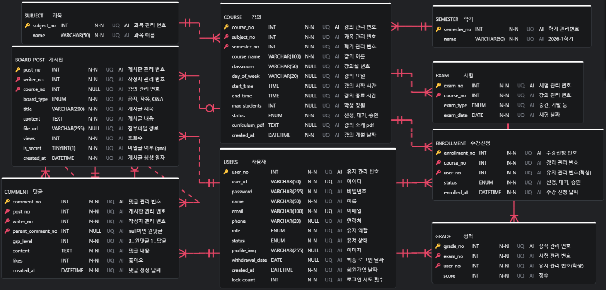

# 🎓 Academy LMS

> Spring 기반 학원 관리 시스템

## 🛠 기술 스택

| 분류 | 기술 |
|------|------|
| Backend | Spring Framework |
| Database | MariaDB |
| Build | Maven |

---

## 👥 팀원 브랜치 정보

| 이름 | 브랜치 |
|------|--------|
| 김강민 | kkm |
| 김승민 | ksm |
| 노현웅 | nhw |
| 장백은 | jbe |
| 조민재 | cmj |

---

## 📋 커밋 메시지 규칙

| 태그 | 설명 | 예시 |
|------|------|------|
| `feat` | 새로운 기능 추가 | `feat: 로그인 기능 추가` |
| `fix` | 버그 수정 | `fix: 회원가입 오류 수정` |
| `edit` | 기존 코드 수정 | `edit: 메인페이지 버튼 수정` |
| `style` | UI 스타일 변경 | `style: 메인페이지 디자인 수정` |
| `chore` | 설정 파일 | `chore: pom.xml 수정` |
| `docs` | 문서 수정 | `docs: README 수정` |
---

## 🔀 작업 순서

```
1. 본인 브랜치에서 작업
2. 커밋 & push
3. 팀장한테 말로 알림
4. 팀장이 main에 머지
```

---

## 🌿 브랜치 구조

```
main
├── kkm   (김강민)
├── ksm   (김승민)
├── nhw   (노현웅)
├── jbo   (장백온)
└── cmj   (조민재)

```

---

## ⚙️ 개발 환경 설정

### 1. 레포지토리 클론
```bash
git clone https://github.com/RE-MERGE/academy-lms.git
```

### 2. 본인 브랜치로 이동
```
IntelliJ: 우측 하단 브랜치 클릭 → 본인 브랜치 Checkout
Eclipse: Team → Switch To → 본인 브랜치
```

### 3. MariaDB 설정
```
DB명: academy_lms
포트: 9712
```

